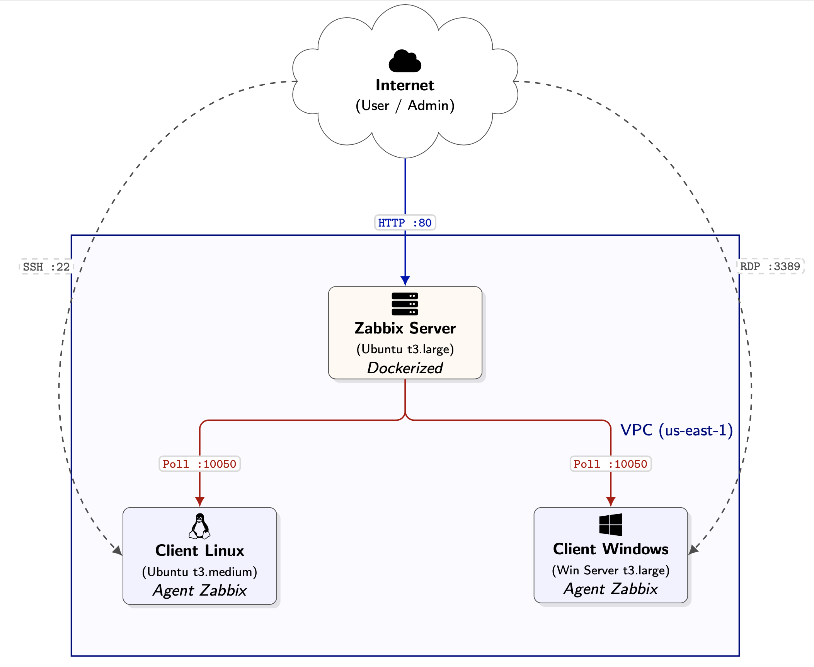
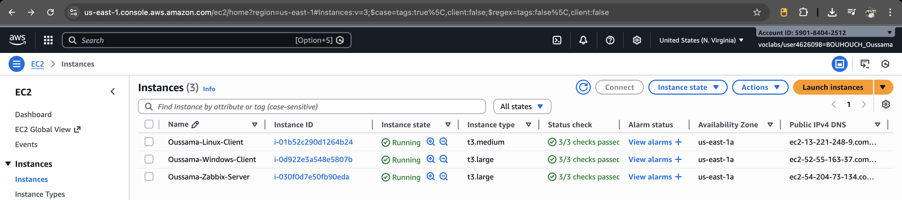
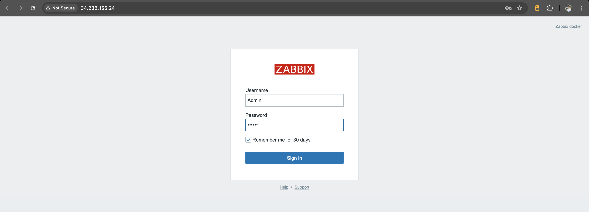
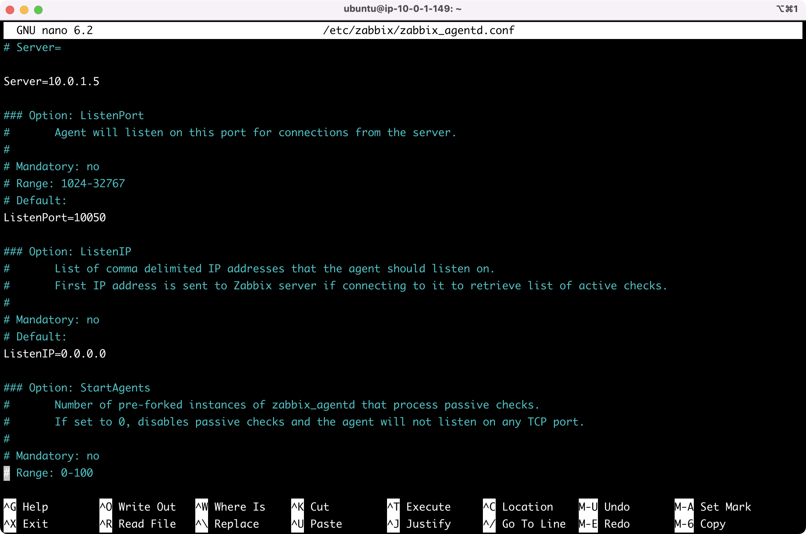
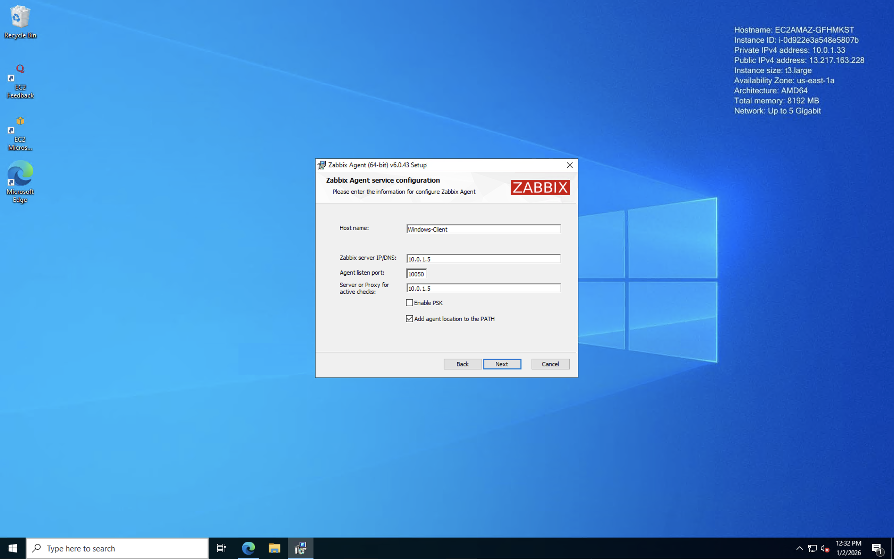
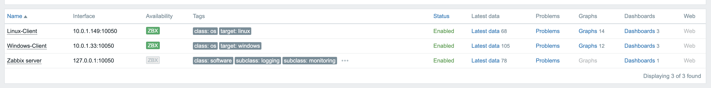
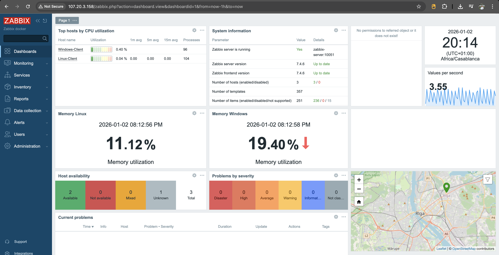

# Mise en œuvre d’une infrastructure cloud de supervision centralisée sous AWS
## Déploiement de Zabbix conteneurisé pour le monitoring d’un parc hybride (Linux & Windows)

---

## 1. Introduction

### Présentation générale du projet
Ce projet s'inscrit dans le cadre d'un projet de fin de module. Il vise à concevoir, déployer et administrer une infrastructure de supervision centralisée, capable de monitorer un environnement hybride composé de serveurs Linux et Windows. L'objectif est de mettre en œuvre une solution robuste, évolutive et sécurisée en s'appuyant sur les services du cloud public AWS et les technologies de conteneurisation.

### Objectifs de la supervision centralisée
La supervision centralisée répond à plusieurs impératifs critiques pour la gestion des infrastructures informatiques modernes :
*   **Visibilité globale** : Centraliser les métriques de performance et les logs de l'ensemble du parc machines.
*   **Réactivité** : Détecter et alerter en temps réel sur les incidents ou les dégradations de service.
*   **Optimisation** : Analyser les tendances d'utilisation des ressources (CPU, RAM, Disque) pour optimiser le dimensionnement des instances.

### Présentation des technologies
Le projet repose sur l'intégration des technologies suivantes :

*   **AWS (Amazon Web Services)** : Fournisseur de cloud public utilisé pour héberger l'infrastructure (IaaS).
*   **EC2 (Elastic Compute Cloud)** : Service de mise à disposition de capacité de calcul redimensionnable dans le cloud, utilisé pour nos instances serveurs et clients.
*   **Docker & Docker Compose** : Plateforme de conteneurisation permettant de déployer le serveur Zabbix et ses composants de manière isolée, portable et reproductible.
*   **Zabbix** : Solution logicielle de monitoring open-source de niveau entreprise, choisie pour sa flexibilité et sa capacité à surveiller des réseaux, serveurs et applications à grande échelle.

---

## 2. Architecture Réseau

### Description de l’architecture AWS
L'infrastructure est déployée au sein de la région **us-east-1 (N. Virginia)**. Elle repose sur un réseau privé virtuel (VPC) assurant l'isolement logique des ressources et suit les spécifications suivantes :

*   **VPC** : CIDR `10.0.0.0/16`, avec résolution DNS activée.
*   **Sous-réseau Public** : CIDR `10.0.1.0/24`, avec assignation automatique d'IP publique.
*   **Internet Gateway (IGW)** : Attachée au VPC pour permettre l'accès internet.
*   **Routage** : Une route `0.0.0.0/0` pointant vers l'IGW dans la table de routage publique.

### Nomenclature des Ressources
Pour assurer une cohérence et une traçabilité, une convention de nommage stricte a été appliquée :

| Ressource | Nom utilisé |
| :--- | :--- |
| **VPC** | `Oussama-VPC-Zabbix` |
| **Subnet** | `Oussama-Public-Subnet` |
| **Internet Gateway** | `Oussama-IGW` |
| **Route Table** | `Oussama-RT-Public` |
| **Security Group** | `Oussama-SG-Zabbix` |
| **EC2 Zabbix** | `Oussama-Zabbix-Server` |
| **EC2 Linux** | `Oussama-Linux-Client` |
| **EC2 Windows** | `Oussama-Windows-Client` |

### Security Groups
Une configuration stricte du Security Group `Oussama-SG-Zabbix` a été appliquée :
*   **Port 80/443** : Accès Web Zabbix.
*   **Port 10050/10051** : État/Traps Zabbix.
*   **Port 22/3389** : Administration SSH/RDP.


> **Figure 1 : Diagramme de l'architecture réseau AWS et des flux de communication**

---

## 3. Architecture des Instances EC2

Le parc informatique simulé est composé de trois instances EC2 distinctes, dimensionnées selon les besoins de leurs rôles respectifs.

### Tableau récapitulatif des instances

| Instance | OS | Type | Rôle | Justification |
| :--- | :--- | :--- | :--- | :--- |
| **Serveur Zabbix** | Ubuntu Server 22.04 LTS | `t3.large` | Instance maîtresse hébergeant la stack Docker Zabbix (Serveur, Frontend, Base de données). | Nécessité de faire tourner plusieurs conteneurs simultanément et de gérer la charge sans latence. |
| **Client Linux** | Ubuntu Server 22.04 LTS | `t3.medium` | Machine cible (hôte surveillé) représentant un serveur d'application Linux type. | Performances suffisantes pour simuler une charge de travail standard et exécuter l'agent Zabbix. |
| **Client Windows** | Microsoft Windows Server 2022 Base | `t3.large` | Machine cible (hôte surveillé) représentant un serveur d'entreprise Windows. | Windows Server est plus consommateur en ressources ; nécessaire pour une fluidité RDP et stabilité. |


> **Figure 2 : Tableau récapitulatif des instances EC2 dans la console AWS**

---

## 4. Déploiement du Serveur Zabbix

### Étapes de mise en œuvre technique

#### 1. Préparation du serveur
Mise à jour et installation des dépendances sur `Oussama-Zabbix-Server` :
```bash
sudo apt update -y && sudo apt upgrade -y
sudo apt install -y docker.io docker-compose
```

#### 2. Déploiement de la stack
Création de l'environnement de travail et lancement des conteneurs :
```bash
mkdir ~/zabbix-docker && cd ~/zabbix-docker
# Création du fichier docker-compose.yml (voir dépôt)
sudo docker-compose up -d
```

### Accès à l'application
L'interface est accessible via `http://<Public-IP>` avec les identifiants par défaut :
*   **User** : `Admin`
*   **Password** : `zabbix`


> **Figure 3 : Interface de connexion Zabbix après déploiement**

---

## 5. Configuration des Clients (Agents)

Pour permettre la remontée d'informations, l'agent Zabbix a été installé et configuré sur chaque machine cliente.

### 5.1. Client Linux (`Oussama-Linux-Client`)
**Installation de l'agent :**
```bash
sudo apt update -y
sudo apt install -y zabbix-agent
# Vérification de la version
zabbix_agentd -V
```

**Configuration :**
Modification du fichier `/etc/zabbix/zabbix_agentd.conf` :
```ini
Server=<IP_Privée_Zabbix>
ServerActive=<IP_Privée_Zabbix>
Hostname=Linux-Client
```

**Activation du service :**
```bash
sudo systemctl restart zabbix-agent
sudo systemctl enable zabbix-agent
sudo systemctl status zabbix-agent
```

### 5.2. Client Windows (`Oussama-Windows-Client`)
**Installation :**
1.  Téléchargement de l'agent depuis [zabbix.com/download_agents](https://www.zabbix.com/download_agents).
2.  Exécution de l'installeur MSI avec les paramètres suivants :
    *   **Zabbix server** : `<IP_Privée_Zabbix>`
    *   **Zabbix server (active)** : `<IP_Privée_Zabbix>`
    *   **Hostname** : `Windows-Client`

**Validation :**
Vérification via `services.msc` que le service **Zabbix Agent** est en statut `Running` et en démarrage `Automatic`.

### Communication
La communication est établie en mode passif (par défaut), où le serveur Zabbix interroge périodiquement les agents sur les ports TCP 10050.


> **Figure 4.1 : Extrait de la configuration de l'agent Linux**


> **Figure 4.2 : Extrait de la configuration de l'agent Windows**

---

## 6. Supervision et Tableaux de Bord

### Intégration des hôtes
Les deux clients (Linux et Windows) ont été ajoutés manuellement dans l'interface de gestion Zabbix ("Configuration > Hosts"). 

### Attribution des Templates
Pour garantir une supervision pertinente, des modèles (Templates) adaptés ont été appliqués :
*   **Linux** : `Linux by Zabbix agent`
*   **Windows** : `Windows by Zabbix agent`

### Vérification du statut
La réussite de la configuration est validée par l'icône **ZBX** passant au vert dans la liste des hôtes, indiquant une communication fonctionnelle.


> **Figure 5 : Liste des hôtes avec indicateur de disponibilité "ZBX" vert**

### Visualisation des Métriques
Des tableaux de bord (Dashboards) permettent de visualiser en temps réel les indicateurs clés de performance (KPIs) :
*   **CPU Utilization** : Charge processeur.
*   **Memory Usage** : Consommation de la mémoire vive.
*   **System Uptime** : Temps de disponibilité de la machine.


> **Figure 6 : Tableau de bord montrant les graphiques de performance CPU et Mémoire**

---

## 7. Dépôt GitHub

L'ensemble des fichiers de configuration nécessaires à la reproduction de cette infrastructure est versionné sur un dépôt GitHub public.

### Structure du dépôt
Le dépôt est organisé de manière logique pour faciliter la lecture et l'utilisation :
*   `/docker` : Contient le fichier `docker-compose.yaml` pour le serveur Zabbix.
*   `/agents` : Exemples de fichiers de configuration pour les agents Linux et Windows.
*   `/docs` : Documentation technique complémentaire et captures d'écran.
*   `README.md` : Le présent document, servant de point d'entrée principal.

---

## 8. AWS Learner Lab Notes
> [!IMPORTANT]
> **Notes Spécifiques à l'environnement AWS Academy**

Cette infrastructure respecte les contraintes strictes de l'environnement éducatif :
*   **Region** : Utilisation exclusive de **`us-east-1` (N. Virginia)**.
*   **Cost Management** : Arrêt systématique des instances hors utilisation pour préserver les crédits.
*   **Budget** : Monitoring actif de la limite de **50$**.
*   **Auto-shutdown** : Le laboratoire s'arrête automatiquement après 4h. Les conteneurs Docker sont configurés pour redémarrer automatiquement (`restart: always` ou via script au boot) après le rallumage de l'instance.

